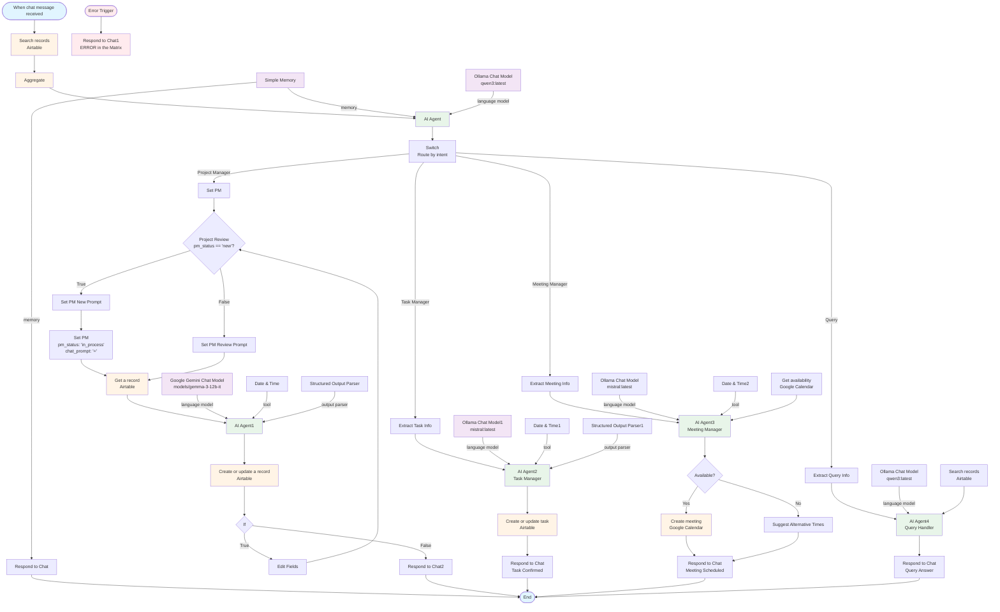
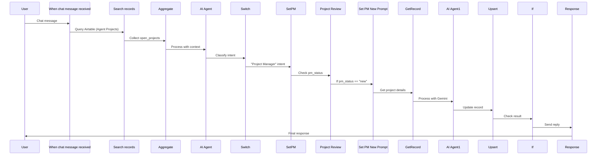
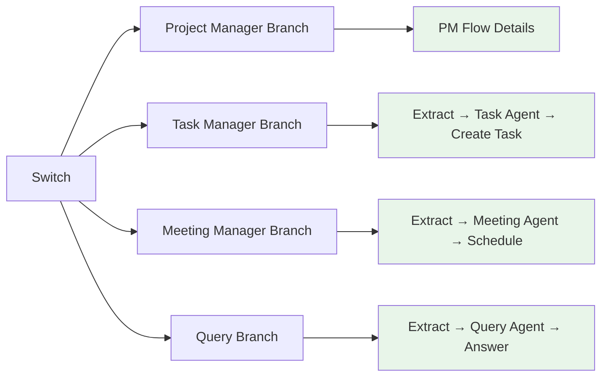
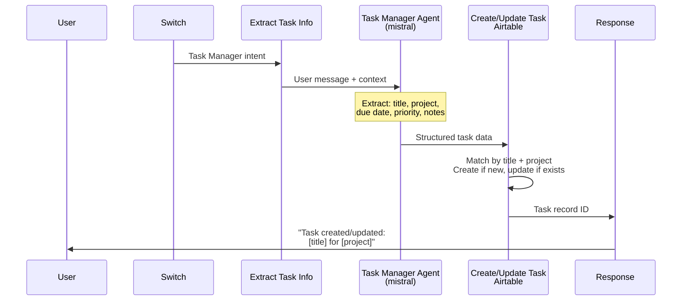
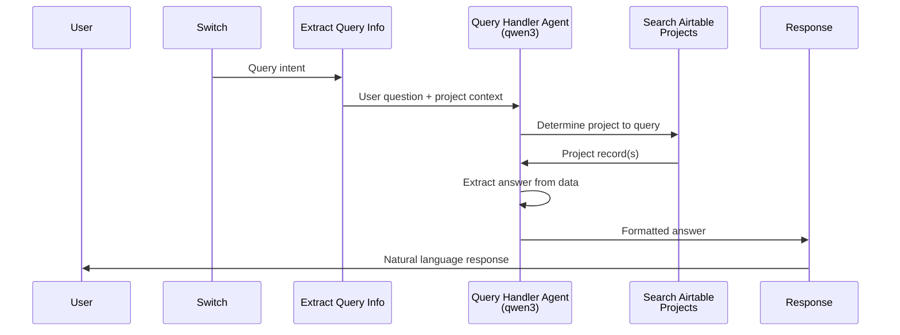
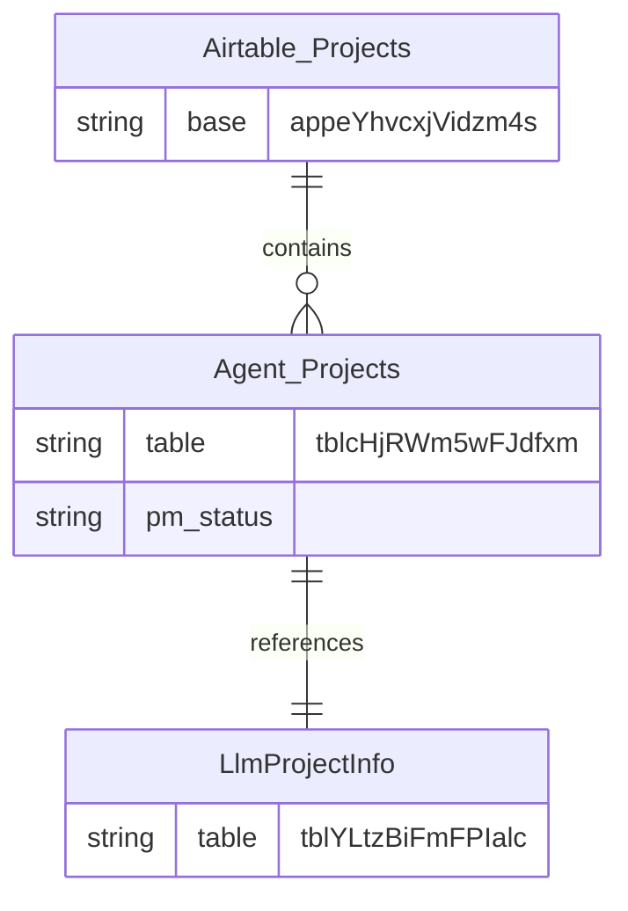
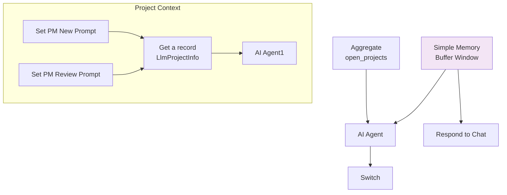
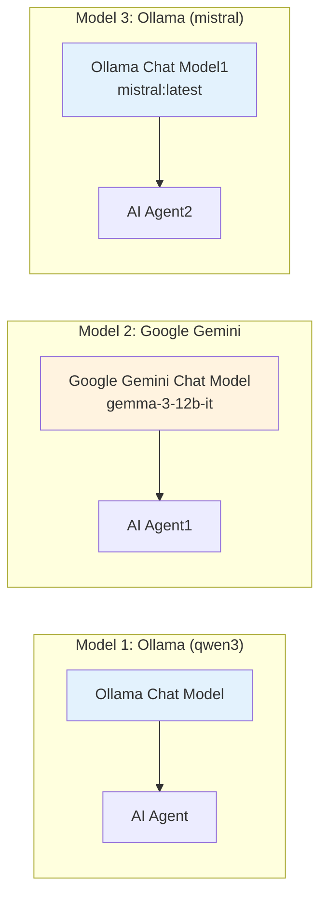
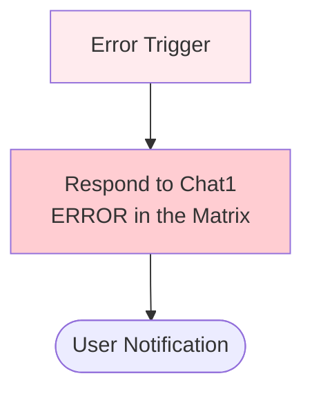

# Barbs Flows

## Ingest

### Main Flow Diagram



### Node Flow by Branch

#### Main Path (Chat → Project Manager)



#### Alternative Paths



### Task Manager Flow



### Meeting Manager Flow

```mermaid
sequenceDiagram
    participant User
    participant Switch
    participant Extract as Extract Meeting Info
    participant Agent3 as Meeting Manager Agent<br/>(mistral)
    participant Calendar as Get Availability<br/>Google Calendar
    participant Check as Check Availability
    participant Create as Create Meeting
    participant Response

    Switch->>Extract: Meeting Manager intent
    Extract->>Agent3: User message + context
    Agent3->>Calendar: Requested time + duration
    Calendar->>Check: Available time slots
    Check->>Create: If available, create event
    Check->>Response: If not, suggest alternatives
    Create->>Response: Meeting created
    Response->>User: Confirmation or alternatives
```

### Query Handler Flow



### Data Flow

#### Airtable Connections



### Memory and Context Flow



### AI Models Configuration



### Error Handling



### Complete Flow Logic

```mermaid
flowchart TD
    Start([Chat Message]) --> Context[Gather Context<br/>Search Projects]
    Context --> Mailman[Mailman Agent<br/>qwen3:latest<br/>Classify Intent]

    Mailman --> Router{Switch Router}

    Router -->|Project Manager| PMFlow[Project Manager Flow]
    Router -->|Task Manager| TFlow[Task Manager Flow]
    Router -->|Meeting Manager| MFlow[Meeting Manager Flow]
    Router -->|Query| QFlow[Query Handler Flow]

    subgraph PMFlow["🔵 Project Manager Flow"]
        PMFlow --> PMCheck{Project Status}
        PMCheck -->|New| PMNew[Set New Project Prompt]
        PMCheck -->|Existing| PMReview[Set Review Prompt]
        PMNew --> PMGet[Get Project Record]
        PMReview --> PMGet
        PMGet --> PMAgent[Project Agent<br/>Gemini gemma-3-12b-it]
        PMAgent --> PMUpsert[Upsert Project<br/>Update ProjectNotes]
        PMUpsert --> PMIf{Need Review?}
        PMIf -->|Yes| PMEdit[Edit Fields]
        PMIf -->|No| PMRespond[Respond to User]
        PMEdit --> PMCheck
    end

    subgraph TFlow["🟢 Task Manager Flow"]
        TFlow --> TExtract[Extract Task Info]
        TExtract --> TAgent[Task Agent<br/>mistral:latest]
        TAgent --> TUpsert[Upsert Task<br/>Link to Project if exists]
        TUpsert --> TRespond[Confirm Task Creation]
    end

    subgraph MFlow["🟡 Meeting Manager Flow"]
        MFlow --> MExtract[Extract Meeting Info]
        MExtract --> MAgent[Meeting Agent<br/>mistral:latest]
        MAgent --> MCalendar[Check Calendar<br/>Availability]
        MCalendar --> MAvail{Available?}
        MAvail -->|Yes| MCreate[Create Meeting<br/>Google Calendar]
        MAvail -->|No| MSuggest[Suggest Alternatives]
        MCreate --> MRespond[Confirm Meeting]
        MSuggest --> MRespond
    end

    subgraph QFlow["🟣 Query Handler Flow"]
        QFlow --> QExtract[Extract Query Details]
        QExtract --> QSearch[Search Airtable<br/>Find Project]
        QSearch --> QAgent[Query Agent<br/>qwen3:latest]
        QAgent --> QRespond[Answer User Question]
    end

    PMRespond --> End([End])
    TRespond --> End
    MRespond --> End
    QRespond --> End

    ErrorTrigger([Error Trigger]) --> ErrorResp[Error Response<br/>User-Friendly Message]
    ErrorResp --> End

    style Start fill:#e1f5ff
    style End fill:#e1f5ff
    style Mailman fill:#f3e5f5
    style PMAgent fill:#e8f5e9
    style TAgent fill:#e8f5e9
    style MAgent fill:#e8f5e9
    style QAgent fill:#e8f5e9
    style ErrorTrigger fill:#ffebee
    style ErrorResp fill:#ffcdd2
```

### Workflow Status

**State**: In Development (Active: false)

**Completed**:

- ✅ Chat trigger and context gathering
- ✅ Mailman classification agent
- ✅ Project Manager branch structure
- ✅ Basic error handling

**In Progress**:

- 🚧 Switch routing logic (conditions need configuration)
- 🚧 Project Manager upsert mapping
- 🚧 Task Manager complete flow
- 🚧 Meeting Manager complete flow
- 🚧 Query Handler complete flow

**Planned**:

- 📋 Airtable table schema updates (ProjectNotes, Tasks)
- 📋 Structured output schemas for all agents
- 📋 Email ingestion workflow (Day 2)
- 📋 Telegram bot integration
- 📋 Daily digest generation

**Tags**: Data, RAG, AI Agents, Workflow Automation
